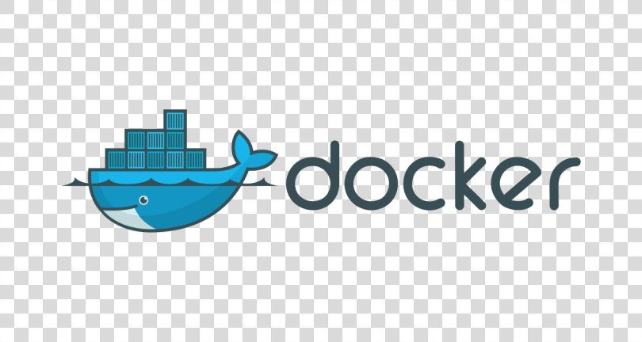
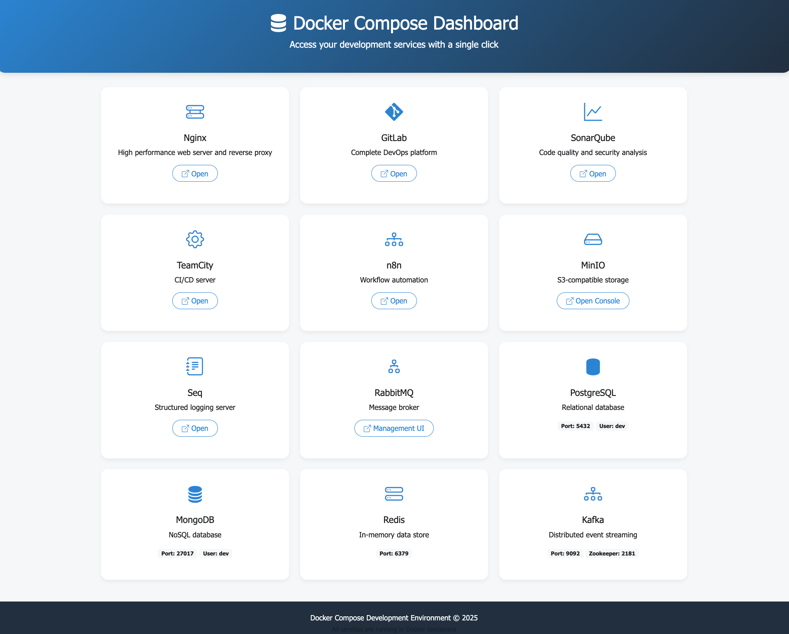

# Docker Compose Development Environment




**English** | [Русский](README-RU.md)

A comprehensive development environment using Docker Compose. Includes all necessary services for full-fledged development.

## 🚀 Features

- **Databases**:
  - PostgreSQL
  - MongoDB
  - Microsoft SQL Server
  - Redis
  - MinIO (S3-compatible storage)

- **Message Brokers**:
  - RabbitMQ
  - Apache Kafka with Zookeeper

- **Development Tools**:
  - Nginx with custom error pages
  - GitLab
  - SonarQube
  - TeamCity
  - n8n (Workflow automation)
  - Seq (Structured logging)

## 📁 Project Structure

```
DockerComposeDev/
├── gitlab/            # GitLab configuration
├── kafka/             # Kafka and Zookeeper
├── minio/             # MinIO object storage
├── mongoDb/           # MongoDB database
├── mssql/             # Microsoft SQL Server
├── n8n/               # Workflow automation
├── nginx/             # Nginx web server
├── postgresql/        # PostgreSQL database
├── rabbitMq/          # RabbitMQ message broker
├── redis/             # Redis key-value store
├── seq/               # Seq logging server
├── sonarqube/         # Code quality analysis
└── teamcity/          # TeamCity CI/CD server
```

## 🛠️ Requirements

- Docker Engine (v20.10+)
- Docker Compose (v2.0+)
- Minimum 8GB RAM (16GB recommended)
- At least 20GB free disk space

## 🚀 Quick Start

1. Clone the repository:
   ```bash
   git clone <repository-url>
   cd DockerComposeDev
   ```

2. Start all services:
   ```bash
   docker-compose -f docker-compose.yml up -d
   ```

3. Access the services:
   - Nginx: http://localhost
   - GitLab: http://gitlab.dev.lan
   - SonarQube: http://sonarqube.dev.lan
   - TeamCity: http://teamcity.dev.lan
   - n8n: http://n8n.dev.lan
   - MinIO Console: http://minio.dev.lan:9001
   - Seq: http://seq.dev.lan:5341

## 🔧 Configuration

### Environment Variables

Each service has its own `.env` file for configuration:

```bash
cp nginx/.env.example nginx/.env
cp postgresql/.env.example postgresql/.env
# And so on for each service
```

### Domain Configuration

Add to your `/etc/hosts` file:

```
127.0.0.1   gitlab.dev.lan
127.0.0.1   sonarqube.dev.lan
127.0.0.1   teamcity.dev.lan
127.0.0.1   n8n.dev.lan
127.0.0.1   minio.dev.lan
127.0.0.1   seq.dev.lan
127.0.0.1   rabbitmq.dev.lan
```

## 🧩 Service Details

### Nginx
- Port: 80, 443
- Custom error pages
- Reverse proxy configuration

### PostgreSQL
- Port: 5432
- Default credentials: dev/dev

### MongoDB
- Port: 27017
- Default credentials: dev/dev

### RabbitMQ
- Web Interface: http://rabbitmq.dev.lan:15672
- Default credentials: guest/guest

### Kafka
- Port: 9092
- Zookeeper port: 2181

## 🛡️ Security

- Change default credentials
- Limit open ports in production
- Enable authentication for all services
- Use HTTPS in production

## 🤝 Contributing

1. Fork the repository
2. Create a feature branch
3. Commit your changes
4. Push to the branch
5. Create a Pull Request

## 📄 License

This project is licensed under the MIT License. See the [LICENSE](LICENSE) file for details.

---

<div align="center">
  Made with ❤️ for developers
</div>
